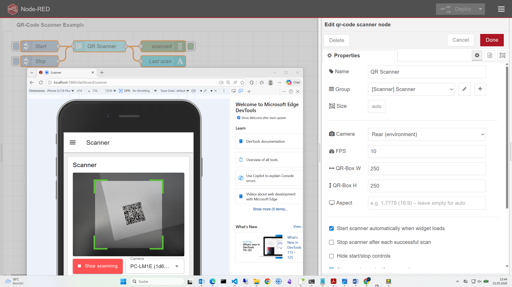

# node-red-dashboard-2-ui-qrcode-scanner

A QR-code / barcode scanner widget for [Node-RED Dashboard 2.0](https://dashboard.flowfuse.com/),
powered by [html5-qrcode](https://github.com/mebjas/html5-qrcode).


> **Note on the package name:** Dashboard 2.0 only auto-detects third-party
> widgets whose npm package name contains `node-red-dashboard-2-`
> (see [`getThirdPartyWidgets`](https://github.com/FlowFuse/node-red-dashboard/blob/main/nodes/utils/index.js)).
> The npm package is therefore published as
> `node-red-dashboard-2-ui-qrcode-scanner`, even though the GitHub repo is
> `node-red-contrib-html5-qrcode-scanner`.

The widget renders a live camera preview inside a Dashboard 2.0 group and emits a
Node-RED message every time a code is decoded.


## Features

- Works with QR codes plus every other format supported by `html5-qrcode`
  (Aztec, Code 39 / 93 / 128, Data Matrix, EAN-13 / 8, ITF, PDF-417, UPC-A / E, ...).
- Responsive camera preview — fills the widget width at a configurable aspect ratio.
- Front or rear camera selection, or facing-mode auto-detect.
- **Cookie-based camera memory** — when controls are visible the last selected camera
  is stored in a browser cookie (`nrdb-qrs-cam`) and restored automatically on the next
  page load.
- **Fixed camera by index** — when controls are hidden, a specific camera can be
  pre-selected by its OS-assigned index (Camera 1, Camera 2, …).
- Configurable FPS, scan-box size and aspect ratio. The scan box scales with the
  widget size automatically.
- Auto-start, stop-on-scan, and torch toggle (where the device supports it).
- Optional suppression of the "Last scan" result display.
- Programmatic control via `msg.action = 'start' | 'stop' | 'toggle' | 'torchOn' | 'torchOff'`.
- Runtime overrides of every option via `msg.ui_update`.

## Installation

From your Node-RED user directory (usually `~/.node-red`):

```bash
npm install node-red-dashboard-2-ui-qrcode-scanner
```

Then restart Node-RED. A new node **`qr-code scanner`** appears in the
**dashboard 2** category.

### Installing from source

```bash
cd ~/.node-red
npm install /path/to/checkout-of-node-red-contrib-html5-qrcode-scanner
```

This puts an entry in `~/.node-red/package.json` whose key is
`node-red-dashboard-2-ui-qrcode-scanner`, which is what Dashboard 2
scans for. If you previously installed the package under the
`node-red-contrib-html5-qrcode-scanner` name, uninstall it first
(`npm uninstall node-red-contrib-html5-qrcode-scanner`) or the widget
will continue to fall back to `ui-template`.

> **Camera access requires HTTPS** (or `http://localhost`). Mobile browsers will
> not enable the camera on plain HTTP from a LAN address.

## Outputs

| Property      | Type   | Description                                            |
| ------------- | ------ | ------------------------------------------------------ |
| `msg.payload` | string | The decoded text.                                      |
| `msg.topic`   | string | `qrcode` for scans, `qrcode/error` for runtime errors. |
| `msg.qrcode`  | object | `{ text, format, result }` – the raw decoder result.   |
| `msg.error`   | string | Present when `topic === 'qrcode/error'`.               |

## Inputs

Send a message in to control the scanner at runtime.

```js
// Start / stop / toggle the scanner
msg = { action: 'start' }
msg = { action: 'stop' }
msg = { action: 'toggle' }

// Torch (where supported by the device + browser)
msg = { action: 'torchOn' }
msg = { action: 'torchOff' }

// Change configuration on the fly
msg = { ui_update: { fps: 15, cameraFacingMode: 'user', stopOnScan: true } }
```





## Configuration

| Option             | Default          | Description                                                                                                                                                           |
| ------------------ | ---------------- | --------------------------------------------------------------------------------------------------------------------------------------------------------------------- |
| `fps`              | `10`             | Frames per second the scanner samples at.                                                                                                                             |
| `qrboxWidth`       | `250`            | Width (px) of the scanning region inside the preview.                                                                                                                 |
| `qrboxHeight`      | `250`            | Height (px) of the scanning region inside the preview.                                                                                                                |
| `aspectRatio`      | *(auto)*         | e.g. `1.7778` for 16:9. Leave blank to let the browser decide.                                                                                                        |
| `cameraFacingMode` | `environment`    | `environment` (rear) or `user` (front). Used as fallback when no cookie or camera index is set.                                                                       |
| `cameraIndex`      | `0` *(auto)*     | Force a specific camera by its OS-assigned index (1 = first, 2 = second, …). Only shown in the node editor when **Hide start/stop controls** is enabled. The camera sequence is determined by the operating system. |
| `autoStart`        | `true`           | Start the scanner as soon as the widget loads.                                                                                                                        |
| `stopOnScan`       | `false`          | Stop the scanner after each successful scan.                                                                                                                          |
| `hideControls`     | `false`          | Hide the start/stop/camera/torch buttons.                                                                                                                             |
| `showTorch`        | `false`          | Show a torch toggle while scanning (if the camera supports it).                                                                                                       |
| `disableFlip`      | `false`          | Disable the mirrored-image scanning attempt (slightly faster).                                                                                                        |
| `hideLastResult`   | `false`          | Hide the "Last scan" result box below the video area.                                                                                                                 |
| `startLabel`       | `Start scanning` | Label of the start button.                                                                                                                                            |
| `stopLabel`        | `Stop scanning`  | Label of the stop button.                                                                                                                                             |

### Camera selection priority

When the widget mounts it picks the initial camera in this order:

1. **Cookie** (`nrdb-qrs-cam`) — the camera the user last selected manually, if it is
   still present in the device's camera list. Only consulted when controls are visible.
2. **Camera index** — if `cameraIndex` is set to a value > 0.
3. **Facing-mode label matching** — searches camera labels for `back`/`rear`/`environment`
   or `front`/`user`/`face` keywords, depending on `cameraFacingMode`.
4. **First available camera** — fallback.

## Example flow

An example flow is included in `examples/qrcode-scanner.json`. Import it
through *Menu → Import → Examples → node-red-contrib-html5-qrcode-scanner*
after installation.

## Building from source

```bash
git clone https://github.com/boehand/node-red-contrib-html5-qrcode-scanner
cd node-red-contrib-html5-qrcode-scanner
npm install
npm run build
```

The build emits `resources/ui-qrcode-scanner.umd.js`, which Dashboard 2.0
loads automatically.

## Author

Created by boehand using Claude Sonnet 4.6

## License

Apache-2.0 – see [LICENSE](LICENSE).

Built on top of [html5-qrcode](https://github.com/mebjas/html5-qrcode)
by Minhaz (also Apache-2.0).
